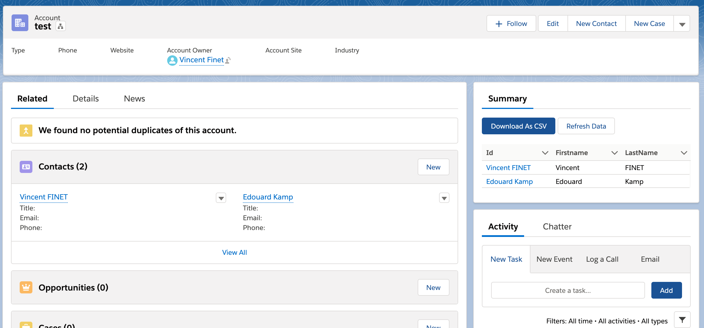
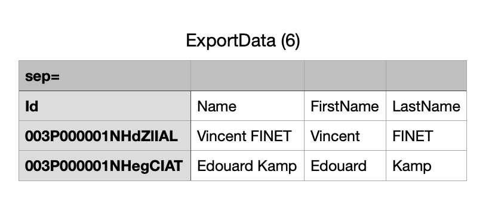
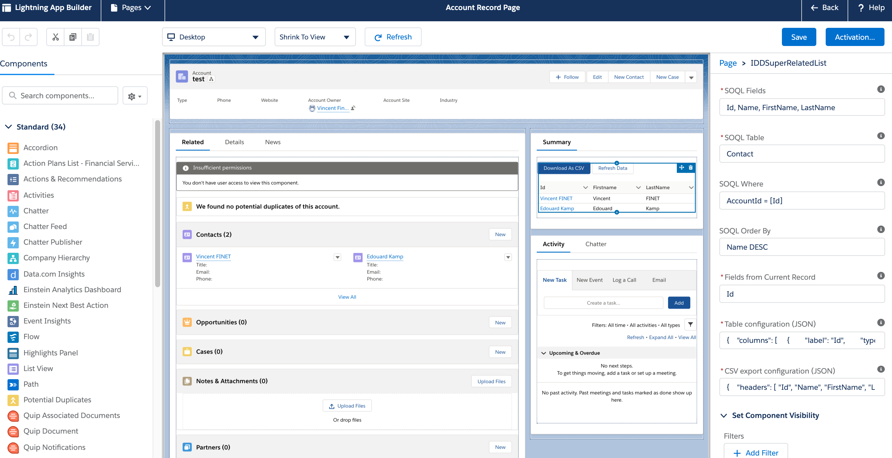

# SuperRelatedListComponent
SuperRelatedList Component (Aura version)

## What's inside?
- Two Apex Classes:
  - SRLDataRetriever_APC (100% covered)
  - SRLDataRetrieverTest_APC (Test class)
- One Aura Bundle:
  - SRLSuperRelatedList_CMP (Component, Design, Controller, Helper)

## What it does...
A component that renders a Related List in Salesforce Lightning Experience UI.
It is highly configurable directly in the Lighnting Experience Builder.
It calls an Apex class to perform a dynamic SOQL query (with the default visibility of the current user).
Values of the current record's field can be injected in the SOQL via a simple syntax in the parameter.

## Deploy to Salesforce (sandbox)

<a href="https://githubsfdeploy-sandbox.herokuapp.com/app/githubdeploy/VinceFINET/SuperRelatedListComponent?ref=master">  
  
</a>

## Deploy to Salesforce (production and developer edition)

<a href="https://githubsfdeploy.herokuapp.com/app/githubdeploy/VinceFINET/SuperRelatedListComponent?ref=master">
  
</a>

## Setup the component
| Name                          | Required | Optional | Description |
| ---                           | ---      | ---      | ---         |
| SOQL Fields                   | Yes      |          | API names of fields you want to select in Salesforce |
| SOQL Table                    | Yes      |          | API name of the table in Salesforce |
| SOQL Where                    |          | Yes      | WHERE statements as in a SOQL query (without the Where!!) |
| SOQL Order By                 |          | Yes      | ORDER BY statements as in a SOQL query (without the Order by!!) |
| Fields from Current Record    | Yes      |          | List of Fields (API name) of the current record, comma separated, that can be use in other fields surrounded byt square bracket |
| Table json configuration      | Yes      |          | JSON configuration with 'columns' (as expected by the aura table) and 'additionalFields' (with name, params and formula). |
| CSV export json configuration |          | Yes      | JSON configuration with 'headers' (an array of strings) and an optional setting for the CSV button |

Note: If the CSV export config is not set, the CSV button will not appear when rendering.

## Example for Contacts and Account

### Screenshots




### Setup

| Name                       | Example |
| ---                        | ---     |
| SOQL Fields                | ` Id, Name, FirstName, LastName ` |
| SOQL Table                 | ` Contact ` |
| SOQL Where                 | ` AccountId = [Id] ` |
| SOQL Order By              | ` Name DESC ` |
| Fields from currend record | ` Id ` |
| Table json configuration   | ` { "columns": [ ... ], "additionalFields": [...] } ` |
| CSV export json configuration | ` { "headers": [ "Id", "Name" ], "button": { "label": "Download as CSV" } } ` |

Full example of a Table json configuration:
``` 
{ 
  "columns": [
    { 
      "label": "Id", 
      "type": "url", 
      "fieldName": "Id_Url", 
      "typeAttributes": {
        "label": { "fieldName": "Name" }, 
        "target": { "fieldName": "_blank" } 
      } 
    },
    { 
      "label": "Firstname", 
      "type": "text", 
      "fieldName": "FirstName" 
    },
    { 
      "label": "Lastname", 
      "type": "text", 
      "fieldName": "FirstName" 
    }
  ],
  "additionalFields": [
    { 
      "name": "Id_Url", 
      "params": ["Id"], 
      "formula": "/one/one.app?#/sObject/[Id]/view" 
    }
  ]
} 
```
